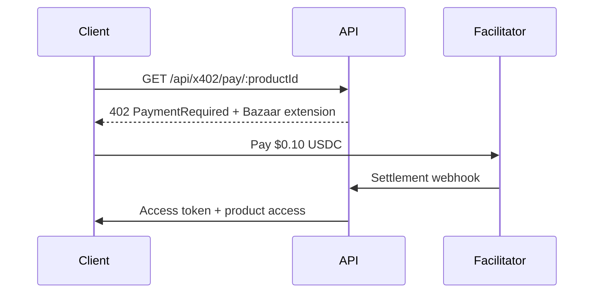

# Monetization Aggregator Platform

A unified platform combining the best monetization models from the world's top 100 revenue websites, adapted for developers, creators, and AI agents.

## 🎯 Revenue Models Integrated

| Model | Source Inspiration | Implementation |
|-------|-------------------|----------------|
| **Subscription Access** | Netflix, Spotify, Salesforce | Tiered plans: Free/Starter/Pro/Team/Enterprise |
| **Pay-per-use API (x402)** | Stripe, AWS, Twilio | Base mainnet USDC, Bazaar-enabled, gasless |
| **Affiliate Commissions** | Amazon Associates, Booking.com | Tiered 10-70% + per-referral bonuses |
| **Marketplace Fees** | App Store, Etsy, Upwork | 10-30% on skills/templates/tools |
| **Freemium Upsell** | Canva, Figma, GitHub | Free tier → paid features |
| **Ad/Sponsorship** | Google, Meta, newsletters | Native, non-intrusive |

## 🏗 Architecture

```
monetization-aggregator/
├── apps/
│   ├── web/                 # Next.js 14 frontend (funnel + dashboard)
│   ├── api/                 # Fastify + Prisma backend
│   └── worker/              # Background jobs (BullMQ)
├── packages/
│   └── shared/              # Types, schemas, utilities (Zod + Decimal.js)
├── infra/
│   ├── docker-compose.yml   # Local development
│   └── vercel.json          # Deployment config
└── docs/
    ├── architecture.md
    └── api-reference.md
```

## 🚀 Quick Start

### Prerequisites
- Node.js 20+
- pnpm 9+
- PostgreSQL 16+
- Redis 7+

### Local Development

```bash
# Clone and install
git clone https://github.com/breezesamuel/monetization-aggregator
cd monetization-aggregator
pnpm install

# Setup environment
cp apps/api/.env.example apps/api/.env
cp apps/web/.env.example apps/web/.env

# Start infrastructure
docker-compose up -d postgres redis

# Setup database
cd apps/api
pnpm db:generate
pnpm db:push
pnpm db:studio  # Optional: view database

# Start development servers
cd ../..
pnpm dev  # Runs web (3000) + api (4000) via Turbo
```

### Production Deployment

```bash
# Deploy web to Vercel
cd apps/web
vercel --prod

# Deploy API to Railway/Render/Fly.io
# Set environment variables from .env.example
```

## 💰 Monetization Stack

| Layer | Technology | Purpose |
|-------|------------|---------|
| **Payments** | x402 (Base USDC) + Alipay | Crypto + CNY subscriptions |
| **Auth** | JWT + Web3 wallet | Email/password + wallet auth |
| **Database** | PostgreSQL + Prisma | ACID transactions, type-safe ORM |
| **Cache** | Redis + Upstash | Sessions, rate limits, caching |
| **Queue** | BullMQ | Background jobs, webhooks, payouts |
| **Email** | Resend | Transactional emails |
| **Analytics** | PostHog | Product analytics, funnels |
| **Deployment** | Vercel (web) + Railway (api) | Serverless + containers |

## 🔗 x402 Payment Integration

The platform implements **x402 v2** with **Bazaar discovery extension**:

- **Network**: Base Mainnet (eip155:8453)
- **Asset**: USDC (0x833589fCD6eDb6E08f4c7C32D4f71b54bdA02913)
- **Price**: $0.10 USDC per API call
- **Facilitator**: GoPlausible (https://facilitator.goplausible.xyz)
- **Gasless**: Merchant pays no gas fees
- **Bazaar**: Auto-cataloged on first settlement
- **vet402**: Auto-buys ≤$0.10 listings daily

### Payment Flow



## 📊 Dashboard Features

- **Real-time Revenue**: Track all revenue streams
- **Subscription Management**: Upgrade/downgrade/cancel
- **Referral Dashboard**: Tier progress, earnings, links
- **Product Analytics**: Sales, conversion funnels, retention
- **x402 Payments**: Settlement status, Bazaar listings
- **Affiliate Payouts**: Request USDC/Alipay payouts

## 🧪 Testing

```bash
# Unit tests
pnpm test

# E2E tests
pnpm test:e2e

# Type checking
pnpm type-check

# Linting
pnpm lint
```

## 📚 API Documentation

- **Swagger UI**: http://localhost:4000/docs
- **OpenAPI Spec**: http://localhost:4000/docs/json

## 🤝 Contributing

1. Fork the repository
2. Create feature branch (`git checkout -b feature/amazing-feature`)
3. Commit changes (`git commit -m 'Add amazing feature'`)
4. Push to branch (`git push origin feature/amazing-feature`)
5. Open Pull Request

## 📄 License

MIT License - see [LICENSE](LICENSE) for details.

## 🔗 Links

- **Live Demo**: https://app.highkingflower.com
- **API Docs**: https://api.highkingflower.com/docs
- **GitHub**: https://github.com/breezesamuel/monetization-aggregator
- **x402 Paywall**: https://x402.highkingflower.com/pay/today
- **Funnel**: https://funnel-eokf5fk31-solmount.vercel.app

---

Built with ❤️ by the BoostAI team. Based on analysis of top 100 global revenue websites.